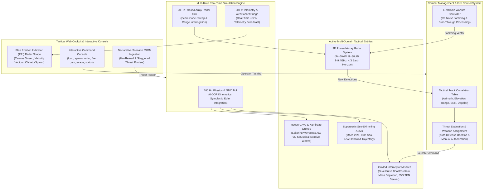

# GarudLink: Real-Time Tactical Air Defense & Missile Guidance Simulator

[](https://en.cppreference.com/w/cpp/20)
[]()
[]()
[]()
[]()

A high-performance, real-time tactical air defense and multi-domain guidance simulator written in **Modern C++20** with zero external library dependencies. The engine simulates 3D kinematics, naval X-band phased-array radar detection physics ($1/R^4$ roll-off), multi-threat rosters (Recon UAVs, Kamikaze Drone swarms, Sea-Skimming Anti-Ship Missiles), active Electronic Warfare / RF Jamming, and closed-loop Guided Missile intercepts using **True Proportional Navigation (TPN)** against evasively maneuvering airborne targets.

---

## 🏛️ System Architecture



---

## 📐 Mathematical Formulations & Physics Derivations

### 1. Phased Array Radar Cross-Section & Range Equation

The power received by the radar receiver from a scattering aerial target is derived from fundamental electromagnetic wave radiation:

1. **Transmitted Power Density at Range $R$ (Isotropic):**
   $$S_{\text{iso}} = \frac{P_t}{4\pi R^2}$$

2. **Power Density with Directional Antenna Gain $G$:**
   $$S_{\text{tgt}} = \frac{P_t \cdot G}{4\pi R^2}$$

3. **Power Intercepted and Reradiated by Target with RCS $\sigma$:**
   $$P_{\text{scat}} = S_{\text{tgt}} \cdot \sigma = \frac{P_t \cdot G \cdot \sigma}{4\pi R^2}$$

4. **Backscatter Power Density Returning to the Radar Aperture:**
   $$S_{\text{back}} = \frac{P_{\text{scat}}}{4\pi R^2} = \frac{P_t \cdot G \cdot \sigma}{(4\pi)^2 \cdot R^4}$$

5. **Effective Receiving Antenna Aperture Area $A_e$:**
   $$A_e = \frac{G \cdot \lambda^2}{4\pi}$$

6. **Total Received Power $P_r$ (The Radar Range Equation):**
   $$P_r = S_{\text{back}} \cdot A_e = \frac{P_t \cdot G^2 \cdot \lambda^2 \cdot \sigma}{(4\pi)^3 \cdot R^4}$$

*Where:*
- $P_t$: Peak transmitter power (Watts)
- $G$: Linear antenna power gain ($G_{\text{linear}} = 10^{G_{\text{dBi}} / 10}$)
- $\lambda$: Carrier wavelength ($\lambda = c / f$, where $c \approx 2.998 \times 10^8\text{ m/s}$)
- $\sigma$: Target Radar Cross Section ($\text{m}^2$)
- $R$: Slant range to target ($\text{m}$)
- Detection is registered if and only if $P_r \ge S_{\min}$ (receiver sensitivity threshold) within the 3D antenna beam cone.

---

### 2. True Proportional Navigation (TPN) Guidance Law

For interceptor terminal guidance against maneuvering targets, **True Proportional Navigation (TPN)** commands acceleration normal to the instantaneous line-of-sight (LOS) vector proportional to the LOS angular turn rate and closing speed:

1. **Relative Position and Velocity Vectors:**
   $$\vec{R} = \vec{R}_{\text{target}} - \vec{R}_{\text{missile}}, \quad \vec{V}_{\text{rel}} = \vec{V}_{\text{target}} - \vec{V}_{\text{missile}}$$

2. **Slant Range and Unit LOS Vector:**
   $$r = \|\vec{R}\|, \quad \hat{R} = \frac{\vec{R}}{r}$$

3. **Instantaneous 3D LOS Angular Rate Vector:**
   $$\vec{\Omega}_{\text{LOS}} = \frac{\vec{R} \times \vec{V}_{\text{rel}}}{r^2} = \frac{\hat{R} \times \vec{V}_{\text{rel}}}{r}$$

4. **Closing Velocity ($V_c$):**
   $$V_c = -\dot{r} = -(\vec{V}_{\text{rel}} \cdot \hat{R})$$

5. **True Proportional Navigation Acceleration Command:**
   $$\vec{a}_{\text{cmd}} = N \cdot V_c \cdot \vec{\Omega}_{\text{LOS}}$$

*Where $N$ is the dimensionless navigation gain (typically $N \in [3.0, 5.0]$).* When $\vec{\Omega}_{\text{LOS}} \to 0$, the missile is on a constant-bearing collision course with zero-effort miss (ZEM).

---

### 3. Rocket Propulsion & Mass Depletion

The guided interceptor models solid rocket motor dual-pulse burn dynamics:
- **Booster Phase**: High thrust $T_{\text{boost}}$ over duration $t_{\text{boost}}$ with mass flow rate $\dot{m}_{\text{boost}}$.
- **Sustainer Phase**: Cruise thrust $T_{\text{sust}}$ maintaining high supersonic velocity against aerodynamic drag.
- **Ballistic Coast Phase**: Rocket burnout where mass settles at structural dry mass $m_{\text{dry}}$:
  $$m(t) = m_0 - \int_0^t \dot{m}(\tau) \, d\tau$$
  $$\vec{a}_{\text{thrust}} = \frac{\vec{T}(t)}{m(t)}$$

---

## 🎯 Dual-Mode Scenario Initialization & Live Operator Injection

The simulator supports both declarative batch scenario execution and live operator commanding:

### 1. Declarative Configuration Files (`JSON`)
Load complete multi-threat mission scenarios from declarative configuration files (`scenarios/default_scenario.json`, `scenarios/defend_strait.json`):
- **Simulation Parameters**: Tick rate (100 Hz), duration, random seed.
- **Radar Properties**: Mast position, peak power, antenna gain, frequency, scan modes (`SURVEILLANCE_360`, `SECTOR_CUE`, `STT`).
- **Threat Rosters**: UAVs, ASMs, and ballistic missiles with initial 3D positions, velocity vectors, radar cross-sections, and maneuver profiles (`NONE`, `WEAVE_6G`, `BARREL_ROLL`).
- **Doctrine & Defense Inventory**: Interceptor count, auto/manual doctrine, and engagement range thresholds.

### 2. Interactive CLI Shell Commands
Operate and task the simulation in real time while the 100 Hz engine runs:
- `load <scenario.json>`: Hot-reload mission configuration from disk.
- `spawn <type> <x> <y> <z> <vx> <vy> <vz> <rcs>`: Inject a custom target vector into the live tactical grid.
- `radar <mode> [center_deg] [width_deg]`: Switch radar mode (`SURVEILLANCE_360`, `SECTOR_CUE`, `STT`).
- `fire <target_id>`: Manually authorize interceptor release on a designated track.
- `jam <target_id> <power_w>`: Simulate active EW/RF jamming on inbound drones.
- `evade <target_id> [g_load] [freq_hz]`: Activate high-g evasive weave on a hostile target.
- `status`: Print active tactical track correlation table and interceptor status.

---

## 🌐 Responsive Web Tactical Dashboard

The simulator includes a tactical Plan Position Indicator (PPI) radar cockpit built with zero external dependencies (HTML5 Canvas, CSS Grid, ES6+ JavaScript, WebSockets):

- **Tactical PPI Radar Scope**: Rotating phosphor sweep, range rings ($10\text{km}$, $25\text{km}$, $50\text{km}$), 4/3 Earth curvature radar horizon indicator ($33.6\text{km}$), hostile diamonds, interceptor deltas, and collision prediction vectors.
- **Click-to-Spawn**: Click anywhere on the radar canvas to dynamically spawn threats at that exact range and bearing.
- **Manual Vector Injection Form**: Sidebar input fields for exact $(X, Y, Z)$ coordinates, velocity vectors $(V_x, V_y, V_z)$, and target RCS.
- **Scenario File Dropzone**: Drag-and-drop or upload `.json` scenario files directly to the running C++ engine.
- **2D Altitude / Downrange Profile**: Real-time cross-section profile view ($0-3000\text{m}$ altitude vs $0-50\text{km}$ downrange).
- **Electronic Warfare Controls**: One-click toggles for 9G evasive weave and active RF noise jamming.
- **After-Action Review (AAR)**: Export detailed flight recorder data directly to CSV (`engagement_report.csv`).

To launch the web console, open `web/index.html` in any browser or launch via the Python orchestrator.

---

## 🛠️ Build & Execution Instructions

### Prerequisites
- **C++ Compiler**: Modern C++20 compliant compiler (GCC 10+, Clang 12+, or MSVC 2019/2022).
- **Python**: Python 3.8+ (for automated orchestration and synthetic self-verification).

### Quickstart (Single Command)
Run the automated orchestrator to execute synthetic self-verifications, compile the C++ engine, host the web dashboard, and launch the simulation:

```bash
python run_garudlink.py
```

### Option A: Using CMake (C++ Engine)

```bash
# 1. Configure build with optimizations
cmake -B build -DCMAKE_BUILD_TYPE=Release

# 2. Compile targets
cmake --build build --config Release -j8

# 3. Execute Unified Test Suite
./build/run_tests          # Linux/macOS
.\build\Release\run_tests.exe  # Windows

# 4. Launch Tactical Simulation with Custom Scenario
./build/tactical_sim --config scenarios/defend_strait.json --port 8080
```

### Option B: Standalone Direct Compilation

```bash
# Compile Test Suite
g++ -std=c++20 -O3 -Iinclude src/Math3D.cpp src/ShipDataBus.cpp src/Entities.cpp src/SimulationEngine.cpp src/ScenarioConfig.cpp src/ScenarioManager.cpp src/WebSocketBridge.cpp tests/test_suite.cpp -o run_tests -lws2_32

# Compile Tactical Simulation Engine
g++ -std=c++20 -O3 -Iinclude src/Math3D.cpp src/ShipDataBus.cpp src/Entities.cpp src/SimulationEngine.cpp src/ScenarioConfig.cpp src/ScenarioManager.cpp src/WebSocketBridge.cpp src/main.cpp -o tactical_sim -lws2_32
```

---

## 🧪 Verification & Validation (V&V)

The simulator includes a deterministic verification suite testing mathematical, radar, and guidance accuracy:

| Test Category | Methodology | Verification Criteria |
| :--- | :--- | :--- |
| **Kinematic Convergence** | 3D numerical integration against analytical trajectory $s(t) = s_0 + v_0 t + \frac{1}{2} a t^2$ | Position error $< 0.25\text{ m}$ ($< 0.1\%$ relative error) |
| **Radar $R^4$ Physics** | Interrogates calibrated targets at $5\text{ km}$, $10\text{ km}$, and $20\text{ km}$ | $P_r(2R) = \frac{1}{16} P_r(R)$ ($\pm 0.3\%$) |
| **TPN Intercept** | Closed-loop missile guidance against $6.0\text{G}$ evasive sinusoidal weaving UAVs | Miss distance $< 10\text{ m}$ (Proximity fuse lethal envelope) |
| **Multi-Threat Swarms** | Concurrent tracking and engagement of staggered drones and supersonic ASMs | Zero memory corruption, deterministic $100\text{ Hz}$ update rate |

---

## 📄 License
MIT License. Developed for research and simulation in modern tactical guidance, phased-array radar modeling, and multi-domain defense systems.
